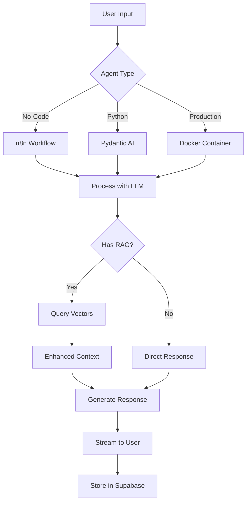

# AI Agent Mastery Course

## Summary

This repository contains all code and resources for the [AI Agent Mastery course](https://community.dynamous.ai/s/ai-mastery-course/). This comprehensive course guides you through the full lifecycle of building AI agents—from initial planning to deployment and monetization, covering no-code prototyping, full-stack development, production deployment, and advanced multi-agent architectures.

## Supabase Tables

The course extensively uses Supabase for data persistence and vector storage:

- **profiles** - User authentication and profile management
- **conversations** - Chat session tracking and history
- **messages** - Individual message storage with user/assistant roles
- **documents** - Vector embeddings for RAG (1536 dimensions for OpenAI)
- **document_metadata** - Source file information and references
- **ai_insights** - Business intelligence data from document analysis
- **companies/contacts/prospects** - CRM-style data management tables
- **team/subcontractors/clients** - Business relationship tracking

## Triggers

### Webhook
- n8n workflows can be triggered via webhook endpoints for real-time agent responses
- FastAPI endpoints in Module 5/6 handle incoming chat requests

### Cron
- RAG pipeline can run on schedule for document processing (Module 6)
- Configured via environment variable `RUN_MODE=single` for one-shot execution

### API
- REST API endpoints for chat interactions (`/chat`, `/conversations`)
- WebSocket connections for real-time streaming responses
- Document upload and processing endpoints

### Manual Script
```bash
# Module 4 - Run Pydantic AI agent
python agent.py

# Module 5 - Start full application
cd backend && uvicorn main:app --reload
cd frontend && npm run dev

# Module 6 - Deploy with Docker
python deploy.py --type local --project localai

# Module 7 - Run LangGraph examples
python 7.6-ParallelAgents/parallel_agents.py
```

## File Tree (explain what each controls)

```
ai-agent-mastery3/
├── 3_n8n_Agents/           # No-code workflow prototypes
│   ├── *.json              # Import directly into n8n
│   └── iterations/         # Progressive workflow improvements
├── 4_Pydantic_AI_Agent/    # Python agent development
│   ├── agent.py            # Core Pydantic AI agent logic
│   ├── tools.py            # Agent tool definitions
│   ├── RAG_Pipeline/       # Document processing & embeddings
│   └── streamlit_ui.py     # Web interface for testing
├── 5_Agent_Application/    # Full-stack application
│   ├── backend/            # FastAPI server with streaming
│   └── frontend/           # React UI with real-time chat
├── 6_Agent_Deployment/     # Production deployment
│   ├── backend_agent_api/  # Containerized agent service
│   ├── backend_rag_pipeline/ # Document processing service
│   ├── frontend/           # Next.js production frontend
│   ├── deploy.py           # Smart deployment orchestrator
│   └── docker-compose.yml  # Multi-service container config
├── 7_Agent_Architecture/   # Advanced patterns
│   ├── LangGraphBasics/    # Graph-based agent flows
│   ├── 7.6-ParallelAgents/ # Concurrent agent execution
│   ├── 7.7-SupervisorAgent/ # Hierarchical agent systems
│   └── 7.8-HumanInTheLoop/ # User approval workflows
├── blueprints/             # Environment variable templates
├── sql/                    # Database schema definitions
├── infra/                  # Terraform infrastructure code
└── tests/                  # End-to-end test suites
```

## Flowchart (Optional Visual)



## Additional Details

### Current Available Modules

- **Module 3**: n8n no-code prototyping with local and cloud AI configurations
- **Module 4**: Pydantic AI with structured outputs, RAG pipeline, and Streamlit UI
- **Module 5**: Full-stack React + FastAPI application with real-time streaming
- **Module 6**: Production-ready Docker deployment with CI/CD and observability
- **Module 7**: Advanced multi-agent patterns with LangGraph and guardrails

### Coming Soon

- Module 8: Agent Testing and Evaluation
- Module 9: Monetizing AI Agents
- Module 10: Next Steps & Bonus Resources

### Key Features

- **Multiple LLM Support**: OpenAI, Anthropic, Groq, Ollama (local)
- **Vector Search**: PGVector with Supabase for semantic search
- **Real-time Streaming**: Server-Sent Events for responsive chat
- **Production Ready**: Docker, GitHub Actions, multi-cloud deployment
- **Observability**: LangFuse integration for agent monitoring

### Mock Data

Download `Mock_Data_For_RAG.zip` for sample documents (Markdown files) from a fictional company to test your RAG pipeline implementations.

### Support & Questions

- [Dynamous Community](https://community.dynamous.ai) - Dedicated discussions
- Live workshops covering specific AI agent components
- Q&A sessions for direct support

## LICENSE

All code, resources, workflows, and templates are governed by the [proprietary Dynamous LICENSE](LICENSE).